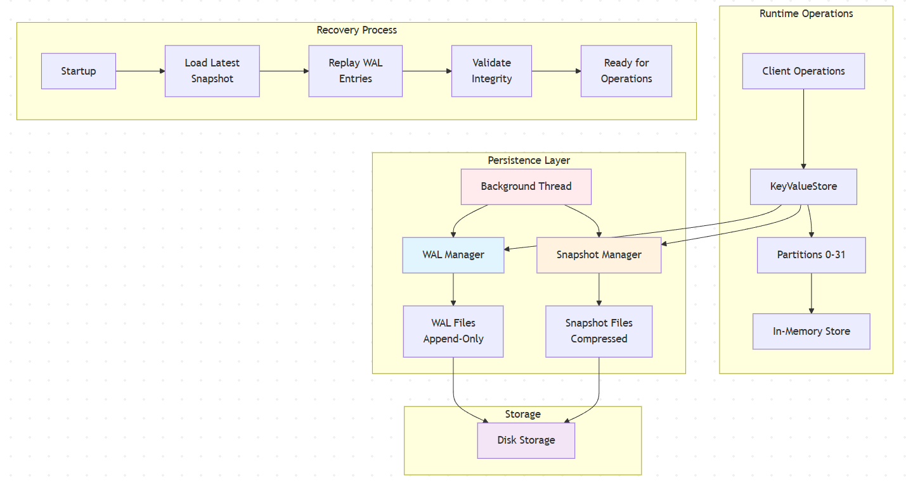
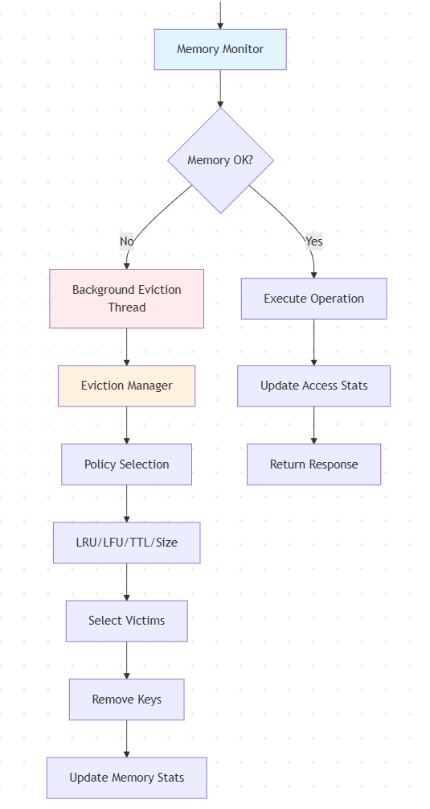

# Future Roadmap

This document outlines the planned features and enhancements for InFlightKv. The roadmap focuses on production readiness, advanced capabilities, and ecosystem integration while maintaining the core design principles of simplicity, performance, and thread safety.

### 1. Persistence for Durability

**Goal**: Enable InFlightKv to survive process restarts and system failures while maintaining high performance.

#### Current State
- In-memory only storage
- Data lost on application restart
- No durability guarantees

#### High-Level Design

- **WAL Manager**: Dedicated component that asynchronously writes all mutations to sequential log files
- **Log Format**: Binary format with operation type, key, value, version, and checksum
- **Background Process**: Separate thread handles WAL writes to avoid blocking main operations
- **File Rotation**: Automatic log rotation based on size/time with compression for older logs

##### Snapshot System
- **Snapshot Manager**: Creates periodic snapshots of the entire dataset
- **Copy-on-Write**: Efficient snapshots using shared memory segments
- **Compression**: LZ4 compression for storage efficiency
- **Incremental**: Only changed data since last snapshot

##### Recovery Process
- **Startup Sequence**:
    1. Load latest snapshot into memory
    2. Replay WAL entries since snapshot
    3. Validate data integrity
    4. Mark store as ready

##### Implementation Strategy
1. **Phase 1**: WAL-only persistence (immediate durability)
2. **Phase 2**: Add snapshot system (faster recovery)
3. **Phase 3**: Optimize with compression and indexing
4. **Phase 4**: Add backup/restore APIs

##### Performance Impact
- **Write Latency**: +10-20% with async WAL
- **Recovery Time**: Proportional to WAL size since last snapshot
- **Storage Overhead**: 2-3x data size (WAL + compressed snapshots)
- **Memory Usage**: Minimal additional overhead

##### Migration Path
- **Backward Compatible**: Existing in-memory mode remains default
- **Gradual Rollout**: Can enable persistence per deployment
- **Zero Downtime**: WAL replay works with running system

# 🏗️ Foundation Features: Essential KV Store Capabilities

Before advancing to advanced features, InFlightKv requires several foundational capabilities that are essential for any production key-value store. These features address core functionality gaps and operational requirements.

### 1. Eviction Policies & Memory Management

**Goal**: Implement configurable eviction strategies to manage memory usage and prevent unbounded growth.

#### Background Execution
Eviction runs on dedicated background threads to ensure the main event loop remains fast and responsive. Memory monitoring triggers eviction asynchronously, preventing eviction operations from blocking client requests.

#### Required Policies
- **LRU (Least Recently Used)**: Evict least recently accessed items
- **LFU (Least Frequently Used)**: Evict least frequently accessed items
- **TTL-based Eviction**: Automatic expiration (complements TTL feature)
- **Size-based Eviction**: Evict largest items when approaching memory limits
- **Random Eviction**: Simple fallback policy

#### System Architecture

### 2. Data Compression

**Goal**: Reduce memory footprint and storage requirements through intelligent compression.

#### Compression Strategies
- **Key Compression**: Dictionary-based compression for repetitive key patterns
- **Value Compression**: Adaptive compression based on data type and size
- **Batch Compression**: Compress multiple small values together
- **LZ4/Snappy**: Fast compression for real-time operations
- **Zstandard**: High-compression ratio for persistence

#### Performance Impact
- **Memory Savings**: 30-70% reduction depending on data patterns
- **CPU Overhead**: 5-15% increase in read/write operations
- **Configurable**: Can be enabled/disabled per deployment

### 3. Key and Value Validation

**Goal**: Ensure data integrity through configurable validation rules.

#### Key Validation
- **Length Limits**: Maximum key length constraints
- **Character Restrictions**: Allowed character sets
- **Naming Conventions**: Pattern-based validation
- **Reserved Keywords**: Prevent conflicts with system keys

#### Value Validation
- **Size Limits**: Maximum value size constraints
- **Type Validation**: JSON schema validation for structured data
- **Content Filtering**: Custom validation rules
- **Data Integrity**: Checksum validation

### 4. Comprehensive Logging & Metrics

**Goal**: Provide observability and monitoring capabilities for operations and performance.

#### Structured Logging
- **Request Logging**: All API requests with timing and metadata
- **Error Logging**: Detailed error information with context
- **Audit Logging**: Security-relevant operations
- **Performance Logging**: Slow operation detection

#### Integration Points
- **Prometheus**: Metrics endpoint for monitoring
- **OpenTelemetry**: Distributed tracing support
- **ELK Stack**: Log aggregation and analysis
- **Health Checks**: Kubernetes-ready status endpoints

### 5. Performance Benchmarking Framework

**Goal**: Establish performance baselines and continuous monitoring.

#### Benchmark Suite
- **Read/Write Benchmarks**: Single operations and batch operations
- **Concurrency Benchmarks**: Multi-threaded performance testing
- **Memory Benchmarks**: Memory usage under various loads
- **Persistence Benchmarks**: Recovery time and durability testing

#### Key Metrics
- **P50/P95/P99 Latencies**: Response time percentiles
- **Throughput**: Operations per second
- **Memory Usage**: Peak and average memory consumption
- **CPU Utilization**: Core usage patterns
- **Error Rates**: Failure percentages under load

### 6. True Event Loop Architecture Migration

**Goal**: Replace single-threaded executors with true event loops for maximum performance.

#### Current Limitations
- Single-threaded executors are not true event loops
- Limited scalability beyond 32 partitions
- Blocking operations can stall partitions
- No efficient I/O multiplexing

#### Benefits
- **True Concurrency**: Handle thousands of concurrent operations
- **I/O Efficiency**: Non-blocking I/O with efficient polling
- **Scalability**: Support for many more partitions
- **Timer Integration**: Built-in timer support for TTL
- **Resource Efficiency**: Single thread handles multiple concerns

#### Migration Strategy
1. **Phase 1**: Implement basic event loop for one partition
2. **Phase 2**: Add I/O multiplexing capabilities
3. **Phase 3**: Migrate all partitions to event loops
4. **Phase 4**: Add advanced features (timers, signals)

#### Performance Gains
- **Throughput**: 5-10x improvement for I/O bound workloads
- **Latency**: Reduced jitter and more predictable response times
- **Scalability**: Support for 100+ partitions
- **Efficiency**: Better CPU cache utilization

---

